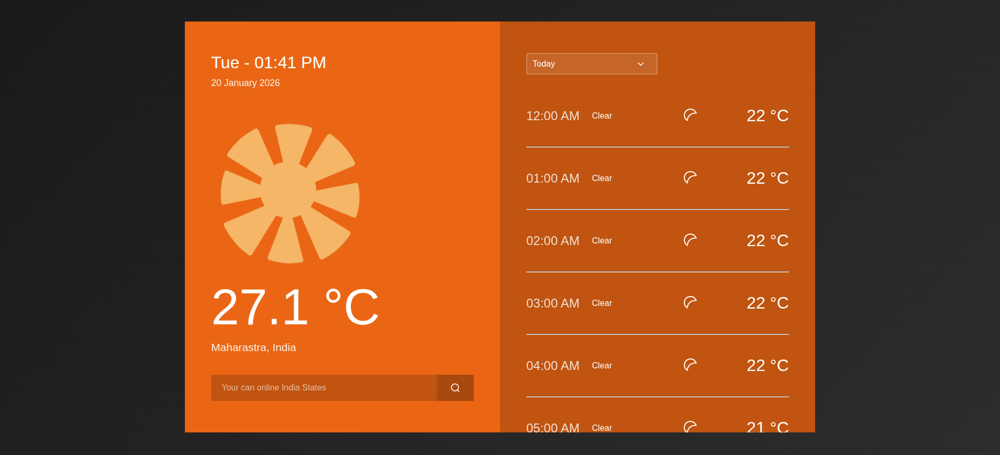

# Weather App

A responsive, interactive weather dashboard that displays real-time conditions and forecasts for Indian states. Built with HTML, CSS, and JavaScript, it features dynamic search, animated SVG weather icons, and smooth GSAP animations. Integrates with the Visual Crossing API to deliver accurate weather data with a modern, user-friendly interface.

🔗 Live Demo: https://rish-38.github.io/Weather-Dash/
